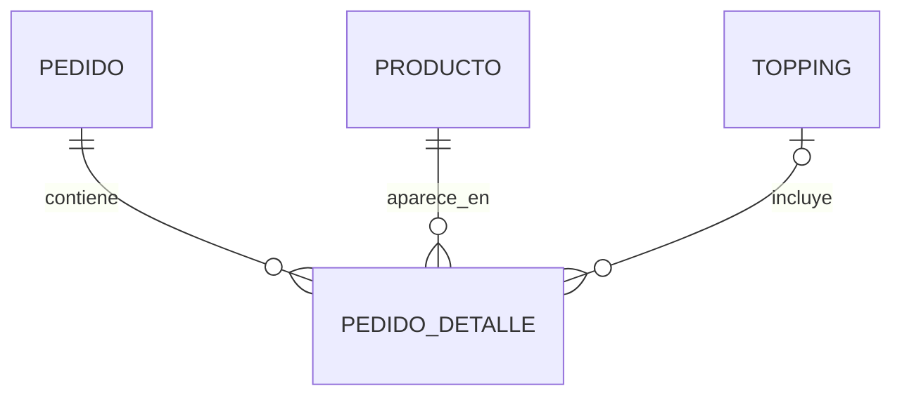

# Tema 5 · Herramientas de desarrollo móvil

## 1. Mapa de herramientas utilizadas

```
┌─────────────────────────────────────────────────────┐
│                 CAPA DE DESARROLLO                  │
├─────────────────────────────────────────────────────┤
│  IDE: VS Code + Claude Code                         │
│  Control versiones: Git (2 repos locales)           │
├─────────────────────────────────────────────────────┤
│                CAPA DE EJECUCIÓN                    │
├─────────────────────────────────────────────────────┤
│  Runtime: Node.js 20+                               │
│  Package manager: npm                               │
│  Container: Docker Desktop (Windows)                │
│  Tunnel: ngrok                                      │
├─────────────────────────────────────────────────────┤
│               CAPA DE PRUEBA                        │
├─────────────────────────────────────────────────────┤
│  Backend: Postman / curl                            │
│  App móvil: Expo Go (iOS/Android)                   │
│  DB: Prisma Studio                                  │
└─────────────────────────────────────────────────────┘
```

## 2. Entorno de desarrollo

### Visual Studio Code (editor principal)

Extensiones usadas:

| Extensión | Propósito |
|---|---|
| Prisma | Syntax highlight + autocompletado para `.prisma` |
| ESLint | Linting de TypeScript |
| Prettier | Formateo automático |
| React Native Tools | Debugging de RN |
| Docker | Gestionar contenedores |
| GitLens | Historial de cambios y blame |
| Claude Code | Asistente IA para refactors y debugging |

### Claude Code (Anthropic CLI)

Asistente IA usado para:
- Generación de código boilerplate (seed, módulos NestJS)
- Diagnóstico de errores complejos (error SASL de Prisma, credentials de Docker)
- Rediseño iterativo de UI (colores, animaciones, layouts)
- Redacción de esta documentación

## 3. Herramientas del Backend

### Node.js
Runtime de JavaScript. Versión ≥ 20.

### npm
Gestor de paquetes. Instala y resuelve dependencias definidas en `package.json`.

Comandos clave:
```bash
npm install            # Instalar dependencias
npm run start:dev      # Levantar backend en modo watch
npm run build          # Compilar TypeScript a dist/
```

### NestJS CLI
```bash
npx nest new ice-cream          # Generar proyecto base
npx nest generate module auth   # Generar módulo
npx nest generate controller    # Generar controlador
npx nest generate service       # Generar servicio
```

### Prisma CLI
```bash
npx prisma init                     # Setup inicial
npx prisma migrate dev --name X     # Nueva migración
npx prisma generate                 # Regenerar cliente
npx prisma db seed                  # Ejecutar seed.ts
npx prisma studio                   # UI para explorar datos
npx prisma migrate reset            # ⚠️ Reiniciar BD (dev only)
```

### Docker + Docker Compose

Usado para levantar PostgreSQL local sin instalarlo en el host.

Comandos clave:
```bash
docker compose up -d          # Levantar contenedores
docker compose down           # Apagar
docker ps                     # Ver contenedores activos
docker logs icecream_postgres # Ver logs
```

Archivo [`docker-compose.yml`](../fly-api/ice-cream/docker-compose.yml):

```yaml
services:
  postgres:
    image: postgres:16
    container_name: icecream_postgres
    restart: always
    environment:
      POSTGRES_USER: postgres
      POSTGRES_PASSWORD: 123456
      POSTGRES_DB: icecream_db
    ports:
      - '5432:5432'
    volumes:
      - postgres_data:/var/lib/postgresql/data

volumes:
  postgres_data:
```

### ngrok
Crea un túnel HTTPS desde una URL pública (ngrok-free.dev) hacia un puerto local (3000 en nuestro caso). Esencial para que la app Expo alcance el backend cuando el celular está con datos móviles o con firewall hostil.

```bash
ngrok config add-authtoken <TOKEN>
ngrok http 3000
# → https://xyz-abc.ngrok-free.dev
```

## 4. Herramientas del Frontend

### Expo SDK
Plataforma que envuelve React Native con:
- Hot reload estable
- Generación de QR para probar en Expo Go
- Acceso a APIs nativas (cámara, localización, etc.) sin configurar Xcode/Android Studio
- Modo **tunnel** con ngrok integrado para conectividad amplia

### Expo CLI
```bash
npx expo start                # Modo por defecto
npx expo start --lan          # Forzar LAN
npx expo start --tunnel       # Tunnel (ngrok de Expo)
npx expo start --clear        # Limpiar cache
```

### Expo Go (app móvil)
App gratuita para iOS/Android que ejecuta el bundle de desarrollo. Se escanea el QR del servidor Metro y la app se abre directo.

### Expo Router
Router basado en el sistema de archivos (estilo Next.js):
- Archivos dentro de `app/` son rutas
- `(tabs)/` define un grupo con tab bar
- `_layout.tsx` define el layout del grupo
- `[id].tsx` son rutas dinámicas

## 5. Herramientas de datos

### Prisma Studio
GUI para explorar los datos de la BD. Se abre con:
```bash
npx prisma studio
# → http://localhost:5555
```

Sirve para:
- Ver tablas y registros
- Editar manualmente (útil para reproducir bugs)
- Agregar datos sin escribir SQL

### psql (opcional)
Cliente CLI de PostgreSQL para queries ad-hoc:
```bash
docker exec -it icecream_postgres psql -U postgres -d icecream_db
```

## 6. Herramientas de pruebas de API

### curl (bash)
```bash
# GET
curl http://localhost:3000/productos

# POST login
curl -X POST http://localhost:3000/auth/login \
  -H "Content-Type: application/json" \
  -d '{"username":"admin","password":"admin123"}'

# PATCH
curl -X PATCH http://localhost:3000/pedidos/1/toggle
```

### Postman (opcional)
Alternativa gráfica a curl, útil para colecciones guardadas.

## 7. Control de versiones

**Git** en dos repositorios locales independientes:

```
PROYECTO/
├── fly-api/       ← repo 1 (backend)
│   └── .git/
├── fly-app/       ← repo 2 (frontend móvil)
│   └── .git/
└── documentacion/ ← doc consolidada
```

Flujo de commits:
```bash
git add <archivos específicos>
git commit -m "feat: descripción del cambio"
```

Convención de mensajes (Conventional Commits):
- `feat:` nueva funcionalidad
- `fix:` corrección de bug
- `refactor:` reestructuración sin cambiar comportamiento
- `docs:` documentación
- `style:` formato/estilo sin lógica
- `chore:` tareas de configuración

## 8. Herramientas de diagramado

### Mermaid
Lenguaje de texto que genera diagramas. Se puede renderizar en:
- GitHub (automático en `.md`)
- VS Code (con extensión Mermaid Preview)
- https://mermaid.live (editor web oficial, gratis, exporta a PNG/JPG/SVG)
- CLI: `@mermaid-js/mermaid-cli` (`mmdc`)

Ejemplo en este proyecto:
````markdown

````

## 9. Comandos resumen

| Qué quiero hacer | Comando |
|---|---|
| Levantar BD | `docker compose up -d` |
| Apagar BD | `docker compose down` |
| Arrancar backend | `npm run start:dev` (en `fly-api/ice-cream`) |
| Migrar BD | `npx prisma migrate dev --name X` |
| Sembrar datos | `npx prisma db seed` |
| Explorar BD visualmente | `npx prisma studio` |
| Arrancar app | `npx expo start --tunnel` (en `fly-app/ice-cream-app`) |
| Tunnel para backend | `ngrok http 3000` |
| Probar endpoint | `curl http://localhost:3000/productos` |
