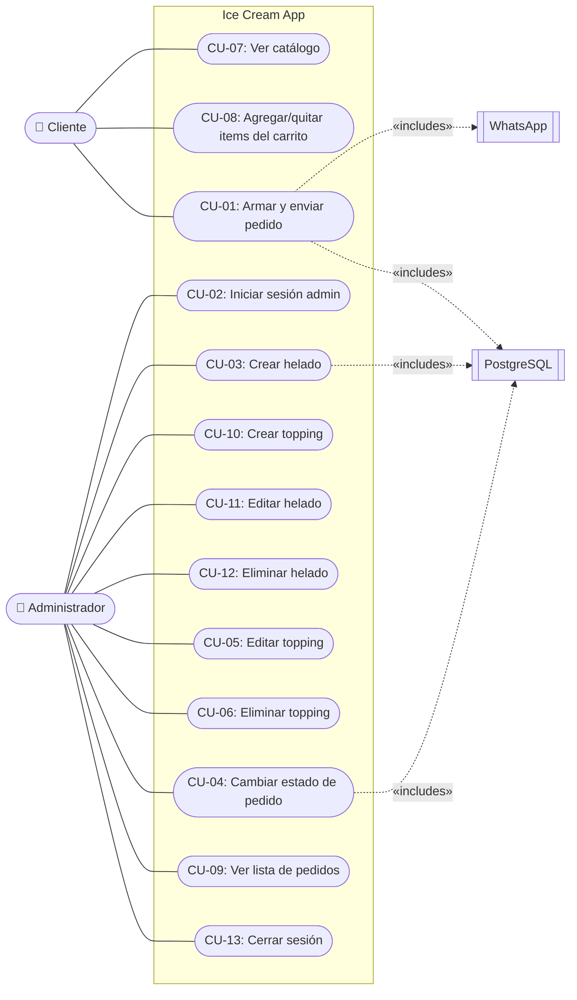

# Diagrama de casos de uso

Representa los actores del sistema y las acciones principales que pueden realizar sobre Ice Cream App.

## Diagrama (Mermaid)

## Resumen de actores

| Actor | Alcance de casos de uso |
|---|---|
| **Cliente** | CU-01, CU-07, CU-08 |
| **Administrador** | CU-02, CU-03, CU-04, CU-05, CU-06, CU-09, CU-10, CU-11, CU-12, CU-13 |
| **WhatsApp (externo)** | Recibe mensaje pre-formateado del CU-01 |
| **PostgreSQL (externo)** | Persiste todo CRUD |

## Resumen de casos de uso

| ID | Nombre | Actor | Descripción breve |
|---|---|---|---|
| CU-01 | Armar y enviar pedido | Cliente | Seleccionar tamaño, helados y toppings, llenar datos, enviar |
| CU-02 | Iniciar sesión admin | Admin | Login con bcrypt |
| CU-03 | Crear helado | Admin | Formulario modal + POST /productos |
| CU-04 | Cambiar estado pedido | Admin | Toggle pendiente ↔ entregado |
| CU-05 | Editar topping | Admin | Formulario precargado + PATCH |
| CU-06 | Eliminar topping | Admin | Confirmación + DELETE |
| CU-07 | Ver catálogo | Cliente | GET /productos + /toppings |
| CU-08 | Agregar/quitar items | Cliente | Manipular el CartContext |
| CU-09 | Ver pedidos | Admin | Lista con detalles completos |
| CU-10 | Crear topping | Admin | POST /toppings |
| CU-11 | Editar helado | Admin | PATCH /productos/:id |
| CU-12 | Eliminar helado | Admin | DELETE /productos/:id |
| CU-13 | Cerrar sesión | Admin | Volver al login admin |

## Cómo convertir a JPG

Ver [COMO-EXPORTAR-A-JPG.md](COMO-EXPORTAR-A-JPG.md).
