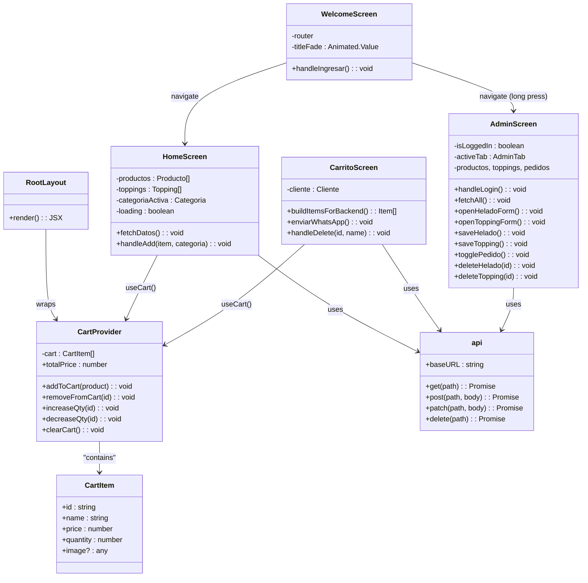

# Diagrama de clases

Modela las clases principales del **backend** (NestJS + Prisma) y cómo se relacionan entre sí.

## Diagrama (Mermaid)

```mermaid
classDiagram
    class AppModule {
        +imports : ProductosModule, PedidosModule, AdminModule, ToppingsModule, AuthModule
    }

    class PrismaService {
        -adapter : PrismaPg
        +onModuleInit() : void
        +enableShutdownHooks(app) : void
    }

    class AuthController {
        -authService : AuthService
        +login(body) : Promise
    }

    class AuthService {
        -prisma : PrismaService
        +login(username, password) : Promise
    }

    class ProductosController {
        -productosService : ProductosService
        +create(dto) : Producto
        +findAll(tipo?) : Producto[]
        +findOne(id) : Producto
        +update(id, dto) : Producto
        +remove(id) : Producto
    }

    class ProductosService {
        -repository : ProductosRepository
        +create(dto) : Producto
        +findAll() : Producto[]
        +findByType(tipo) : Producto[]
        +findOne(id) : Producto
        +update(id, dto) : Producto
        +remove(id) : Producto
    }

    class ProductosRepository {
        -prisma : PrismaService
        +create(data) : Producto
        +findAll() : Producto[]
        +findByType(tipo) : Producto[]
        +findById(id) : Producto
        +update(id, data) : Producto
        +remove(id) : Producto
    }

    class ToppingsController {
        -toppingsService : ToppingsService
        +create(dto) : Topping
        +findAll() : Topping[]
        +findAvailable() : Topping[]
        +findOne(id) : Topping
        +update(id, dto) : Topping
        +remove(id) : Topping
    }

    class ToppingsService {
        -toppingsRepository : ToppingsRepository
        +create(dto) : Topping
        +findAll() : Topping[]
        +findAvailable() : Topping[]
        +findOne(id) : Topping
        +update(id, dto) : Topping
        +remove(id) : Topping
    }

    class ToppingsRepository {
        -prisma : PrismaService
    }

    class PedidosController {
        -pedidosService : PedidosService
        +create(dto) : Pedido
        +findAll() : Pedido[]
        +toggleCompletado(id) : Pedido
    }

    class PedidosService {
        -repository : PedidosRepository
        -productosService : ProductosService
        -toppingsService : ToppingsService
        +crearPedido(dto) : Pedido
        +findAll() : Pedido[]
        +toggleCompletado(id) : Pedido
    }

    class PedidosRepository {
        -prisma : PrismaService
        +createPedido(data, detalles) : Pedido
        +findAll() : Pedido[]
        +toggleCompletado(id) : Pedido
    }

    class AdminController {
        -adminService : AdminService
        +getStats() : Dashboard
        +getReporte(inicio, fin) : Pedido[]
    }

    class AdminService {
        -adminRepo : AdminRepository
        +getDashboard() : Dashboard
        +getPedidosRecientes(inicio?, fin?) : Pedido[]
    }

    class ApiKeyGuard {
        +canActivate(context) : boolean
    }

    class CreateProductoDto {
        +nombre : string
        +tipo : string
        +precio : number
        +disponible? : boolean
    }

    class CreatePedidoDto {
        +clienteNombre : string
        +telefono : string
        +direccion : string
        +items : DetallePedidoDto[]
    }

    class DetallePedidoDto {
        +productoId : number
        +toppingId? : number
    }

    AppModule --> PrismaService
    AuthController --> AuthService
    AuthService --> PrismaService
    ProductosController --> ProductosService
    ProductosService --> ProductosRepository
    ProductosRepository --> PrismaService
    ToppingsController --> ToppingsService
    ToppingsService --> ToppingsRepository
    ToppingsRepository --> PrismaService
    PedidosController --> PedidosService
    PedidosService --> PedidosRepository
    PedidosService --> ProductosService
    PedidosService --> ToppingsService
    PedidosRepository --> PrismaService
    AdminController --> AdminService
    AdminController --> ApiKeyGuard : «uses»
    ProductosController ..> CreateProductoDto : uses
    PedidosController ..> CreatePedidoDto : uses
    CreatePedidoDto --> DetallePedidoDto : contains
```

## Convenciones

- `-` atributo privado
- `+` método público
- `?` parámetro opcional
- `--> ` composición/dependencia fuerte
- `..>` uso/lectura (dependencia débil)

## Diagrama de clases del frontend (componentes principales)

