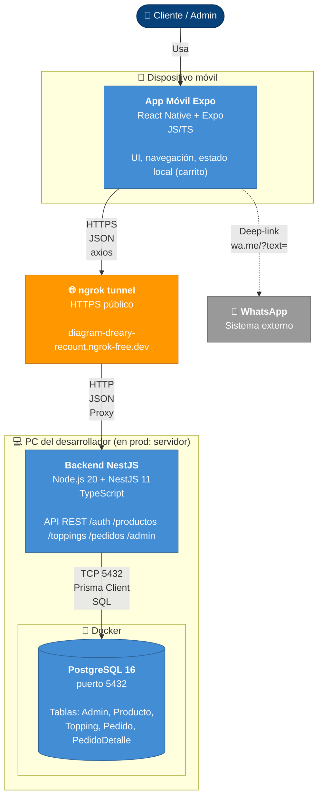

# C4 · Nivel 2 · Diagrama de Contenedores

El nivel de contenedores muestra las **unidades desplegables** del sistema y su comunicación.

En términos de C4, un "contenedor" NO es un contenedor Docker — es cualquier ejecutable/proceso/servicio (app móvil, servidor, BD).

## Diagrama (Mermaid)



## Contenedores

### 1. App Móvil Expo

- **Tecnología:** React Native + Expo SDK + TypeScript
- **Despliegue:** Celular iOS/Android (via Expo Go en dev, APK/AAB en prod)
- **Responsabilidad:** UI, navegación, estado del carrito (CartContext), llamadas HTTP al backend
- **Código:** repositorio `fly-app/ice-cream-app`

### 2. Backend NestJS

- **Tecnología:** Node.js + NestJS 11 + TypeScript + Prisma
- **Despliegue:** Proceso Node en PC dev (en prod: VPS con PM2/Docker)
- **Responsabilidad:** Validar inputs, aplicar lógica de negocio, persistir en BD
- **Puerto:** 3000
- **Código:** repositorio `fly-api/ice-cream`

### 3. Base de datos PostgreSQL

- **Tecnología:** PostgreSQL 16 en Docker
- **Despliegue:** Contenedor Docker `icecream_postgres`
- **Responsabilidad:** Persistir todas las entidades
- **Puerto:** 5432
- **Acceso:** Solo desde el backend (no expuesto a Internet)

### 4. ngrok Tunnel (solo dev)

- **Tecnología:** ngrok (SaaS)
- **Despliegue:** Proceso local que abre un túnel público HTTPS → local
- **Responsabilidad:** Exponer el backend al Internet para que el celular lo alcance sin estar en la misma WiFi
- **URL:** `https://diagram-dreary-recount.ngrok-free.dev`

### 5. WhatsApp (externo)

- **Tecnología:** App de mensajería
- **Integración:** Deep-link `https://wa.me/TELEFONO?text=URL_ENCODED`
- **Dirección:** La app envía UN mensaje (fire-and-forget), no recibe respuestas

## Flujos de datos

### Flujo A — Catálogo (cliente abre la app)

```
App móvil  ──GET /productos──►  ngrok  ──►  Backend  ──SELECT──►  PostgreSQL
App móvil  ◄──JSON────────────  ngrok  ◄─  Backend  ◄──rows──  PostgreSQL
App móvil  ──GET /toppings───►  ngrok  ──►  Backend  ──SELECT──►  PostgreSQL
App móvil  ◄──JSON────────────  ngrok  ◄─  Backend  ◄──rows──  PostgreSQL
```

### Flujo B — Envío de pedido

```
App móvil  ──POST /pedidos──►  ngrok  ──►  Backend  ──BEGIN TX──►  PostgreSQL
                                              │       ──INSERT──►
                                              │       ──INSERT──►
                                              │       ──COMMIT───►
App móvil  ◄──201 + data──────  ngrok  ◄─  Backend  ◄───────────

App móvil  ──deep-link wa.me──────────────►  WhatsApp
```

### Flujo C — Login admin

```
App móvil  ──POST /auth/login──►  ngrok  ──►  Backend
                                                │
                                                ├──findUnique──►  PostgreSQL
                                                │    ◄──admin────
                                                │
                                                └──bcrypt.compare
                                                │
App móvil  ◄──200 + admin────  ngrok  ◄─  Backend
```
