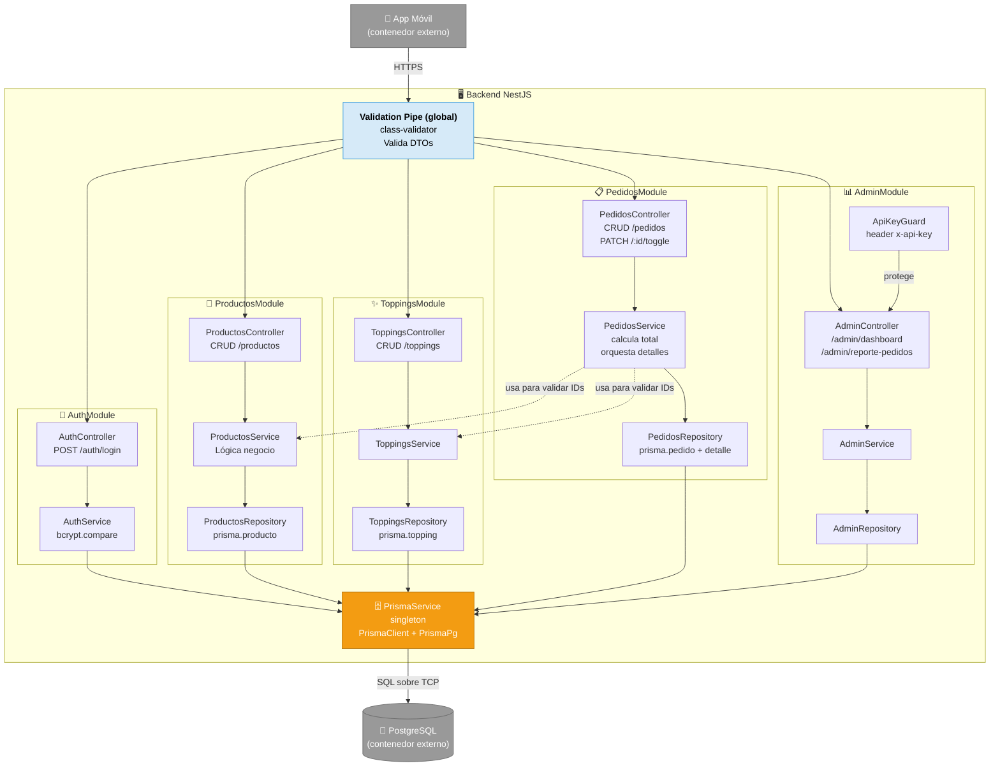

# C4 · Nivel 3 · Diagrama de Componentes (Backend)

El nivel 3 del modelo C4 muestra los **componentes internos** de un contenedor. Aquí se expande el contenedor "Backend NestJS" en sus módulos y servicios.

## Diagrama (Mermaid)



## Componentes

### Validation Pipe (global)

- **Tecnología:** `@nestjs/common` + `class-validator` + `class-transformer`
- **Responsabilidad:** Validar automáticamente los DTOs en TODAS las rutas (whitelist + forbidNonWhitelisted + transform). Rechaza requests mal formados con HTTP 400.
- **Registro:** `main.ts` via `app.useGlobalPipes(new ValidationPipe({...}))`

### AuthModule

| Componente | Función |
|---|---|
| `AuthController` | Expone POST `/auth/login`, recibe `{username, password}` |
| `AuthService` | Busca admin en BD, compara con bcrypt |

### ProductosModule

| Componente | Función |
|---|---|
| `ProductosController` | Expone CRUD de productos (`GET`, `POST`, `PATCH`, `DELETE`) |
| `ProductosService` | Lógica de negocio, lanza `NotFoundException` si no existe |
| `ProductosRepository` | Queries a `prisma.producto` |

### ToppingsModule

Misma estructura que ProductosModule pero para toppings. También expone GET `/toppings/disponibles` (solo los activos).

### PedidosModule

| Componente | Función |
|---|---|
| `PedidosController` | Expone `POST /pedidos` (crear), `GET /pedidos` (listar), `PATCH /pedidos/:id/toggle` |
| `PedidosService` | Calcula total desde precios actuales, orquesta la creación de detalles. **Depende de** `ProductosService` y `ToppingsService` |
| `PedidosRepository` | Inserta pedido + detalles como transacción anidada |

### AdminModule

| Componente | Función |
|---|---|
| `AdminController` | Expone `/admin/dashboard` y `/admin/reporte-pedidos`. **Protegido por** `ApiKeyGuard` |
| `ApiKeyGuard` | Valida header `x-api-key` |
| `AdminService` | Agregaciones y reportes |
| `AdminRepository` | Queries complejas de estadísticas |

### PrismaService (infraestructura)

- Singleton que extiende `PrismaClient`
- Configura el adapter `PrismaPg` para PostgreSQL
- Gestiona ciclo de vida (`onModuleInit` conecta, `enableShutdownHooks` cierra limpiamente)
- Inyectado en todos los Repositories y algunos Services (Auth)

## Dependencias entre componentes

- **Sentido:** Controllers → Services → Repositories → PrismaService → BD
- **Nunca al revés:** un Repository NO llama a un Service (evita ciclos)
- **Cross-module:** `PedidosService` usa `ProductosService` y `ToppingsService` para validar IDs antes de crear detalles (acoplamiento aceptable porque todo es parte del mismo bounded context "pedido")

## Flujo completo: crear un pedido

```
App ──POST /pedidos──► VP (valida DTO)
                        │
                        ▼
                   PedidosController.create(dto)
                        │
                        ▼
                   PedidosService.crearPedido(dto)
                        │
                        ├──► ProductosService.findOne(productoId)  ─┐
                        │                                            │ por cada item
                        ├──► ToppingsService.findOne(toppingId?)    ─┘
                        │
                        │   (calcula precioProducto + precioTopping = subtotal)
                        │   (suma todos los subtotales = totalGeneral)
                        │
                        ▼
                   PedidosRepository.createPedido(data, detalles)
                        │
                        ▼
                   prisma.pedido.create({
                     data: { ..., detalles: { create: detalles } },
                     include: { detalles: { include: { producto, topping } } }
                   })
                        │
                        ▼
                   PostgreSQL (INSERT Pedido, INSERT PedidoDetalle x N)
                        │
                        ▼
                   Devuelve pedido completo → JSON 201
```
