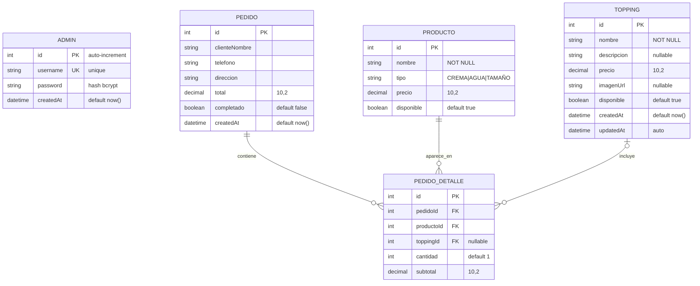

# Diagrama Entidad-Relación (Base de Datos)

Modela las 5 tablas de la base de datos PostgreSQL y sus relaciones.

## ERD (Mermaid)



## Cardinalidades

| Relación | Cardinalidad | Lectura |
|---|---|---|
| PEDIDO ↔ PEDIDO_DETALLE | `1 : N` | "Un pedido tiene uno o más detalles" |
| PRODUCTO ↔ PEDIDO_DETALLE | `1 : N` | "Un producto puede aparecer en muchos detalles" |
| TOPPING ↔ PEDIDO_DETALLE | `0..1 : N` | "Un detalle puede tener cero o un topping; un topping puede estar en muchos detalles" |

## Integridad referencial

- **PedidoDetalle.pedidoId** → Pedido.id (ON DELETE debería ser CASCADE en producción)
- **PedidoDetalle.productoId** → Producto.id (ON DELETE RESTRICT: no permitir borrar un producto con pedidos asociados)
- **PedidoDetalle.toppingId** → Topping.id (ON DELETE SET NULL o RESTRICT)

## Índices

| Tabla | Índice | Motivo |
|---|---|---|
| `Admin` | UNIQUE(`username`) | Evitar duplicados en login |
| `Pedido` | Ordenar por `createdAt DESC` | Listar pedidos recientes primero |
| `PedidoDetalle` | FK(`pedidoId`, `productoId`, `toppingId`) | Joins rápidos |

## Ejemplo de datos (seed)

### Tabla Admin

| id | username | password (hash) | createdAt |
|----|---|---|---|
| 1 | admin | `$2a$10$...` | 2026-04-17 05:22:58 |

### Tabla Producto (extracto)

| id | nombre | tipo | precio | disponible |
|----|---|---|---|---|
| 13 | Pequeño | TAMAÑO | 0.00 | true |
| 14 | Mediano | TAMAÑO | 0.00 | true |
| 15 | Grande | TAMAÑO | 0.00 | true |
| 4 | Helado de Fresa | CREMA | 4500.00 | true |
| 5 | Helado de Chocolate | CREMA | 4500.00 | true |
| 9 | Helado de Limón | AGUA | 3500.00 | true |

### Tabla Topping (extracto)

| id | nombre | descripcion | precio |
|----|---|---|---|
| 1 | Chocolate derretido | Salsa de chocolate caliente | 2000.00 |
| 3 | Arequipe | Arequipe casero | 2500.00 |
| 8 | Galleta Oreo | Galletas Oreo trituradas | 2500.00 |

### Tabla Pedido

| id | cliente | teléfono | dirección | total | completado | createdAt |
|----|---|---|---|---|---|---|
| 4 | Juan Pérez | 3214567890 | Calle 10 # 5-20 | 12500.00 | false | 2026-04-17 05:49:30 |
| 5 | María Gómez | 3156789012 | Carrera 8 # 15-30 | 18000.00 | true | 2026-04-17 05:49:30 |

### Tabla PedidoDetalle (para Pedido 4)

| id | pedidoId | productoId | toppingId | cantidad | subtotal |
|----|---|---|---|---|---|
| 1 | 4 | 15 (Grande) | NULL | 1 | 0.00 |
| 2 | 4 | 4 (Fresa) | NULL | 2 | 9000.00 |
| 3 | 4 | 4 (Fresa) | 3 (Arequipe) | 1 | 2500.00 |

## DDL generado por Prisma (extracto)

```sql
CREATE TABLE "Admin" (
    "id" SERIAL NOT NULL PRIMARY KEY,
    "username" TEXT NOT NULL UNIQUE,
    "password" TEXT NOT NULL,
    "createdAt" TIMESTAMP(3) NOT NULL DEFAULT CURRENT_TIMESTAMP
);

CREATE TABLE "Producto" (
    "id" SERIAL NOT NULL PRIMARY KEY,
    "nombre" TEXT NOT NULL,
    "tipo" TEXT NOT NULL,
    "precio" DECIMAL(10,2) NOT NULL,
    "disponible" BOOLEAN NOT NULL DEFAULT true
);

CREATE TABLE "Topping" (
    "id" SERIAL NOT NULL PRIMARY KEY,
    "nombre" TEXT NOT NULL,
    "descripcion" TEXT,
    "precio" DECIMAL(10,2) NOT NULL,
    "imagenUrl" TEXT,
    "disponible" BOOLEAN NOT NULL DEFAULT true,
    "createdAt" TIMESTAMP(3) NOT NULL DEFAULT CURRENT_TIMESTAMP,
    "updatedAt" TIMESTAMP(3) NOT NULL
);

CREATE TABLE "Pedido" (
    "id" SERIAL NOT NULL PRIMARY KEY,
    "clienteNombre" TEXT NOT NULL,
    "telefono" TEXT NOT NULL,
    "direccion" TEXT NOT NULL,
    "total" DECIMAL(10,2) NOT NULL,
    "completado" BOOLEAN NOT NULL DEFAULT false,
    "createdAt" TIMESTAMP(3) NOT NULL DEFAULT CURRENT_TIMESTAMP
);

CREATE TABLE "PedidoDetalle" (
    "id" SERIAL NOT NULL PRIMARY KEY,
    "pedidoId" INTEGER NOT NULL,
    "productoId" INTEGER NOT NULL,
    "toppingId" INTEGER,
    "cantidad" INTEGER NOT NULL DEFAULT 1,
    "subtotal" DECIMAL(10,2) NOT NULL,
    FOREIGN KEY ("pedidoId") REFERENCES "Pedido"("id"),
    FOREIGN KEY ("productoId") REFERENCES "Producto"("id"),
    FOREIGN KEY ("toppingId") REFERENCES "Topping"("id")
);
```
