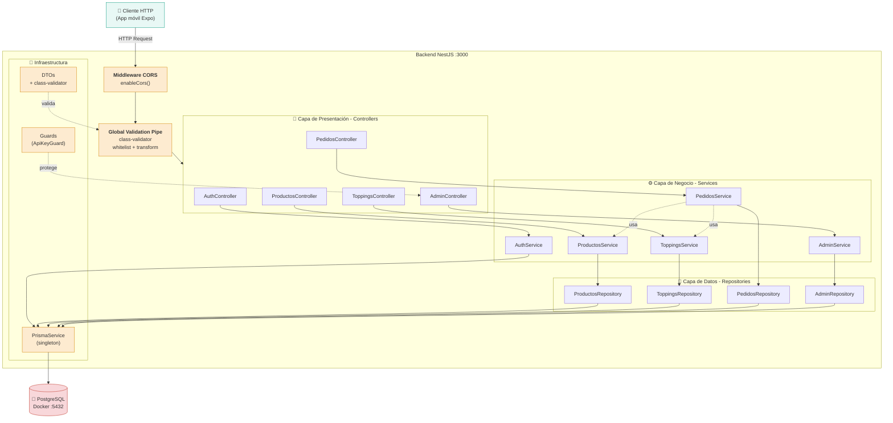
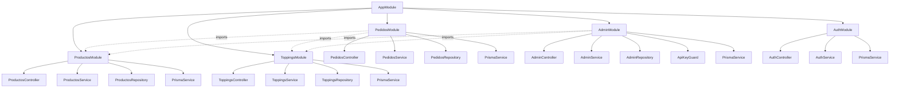
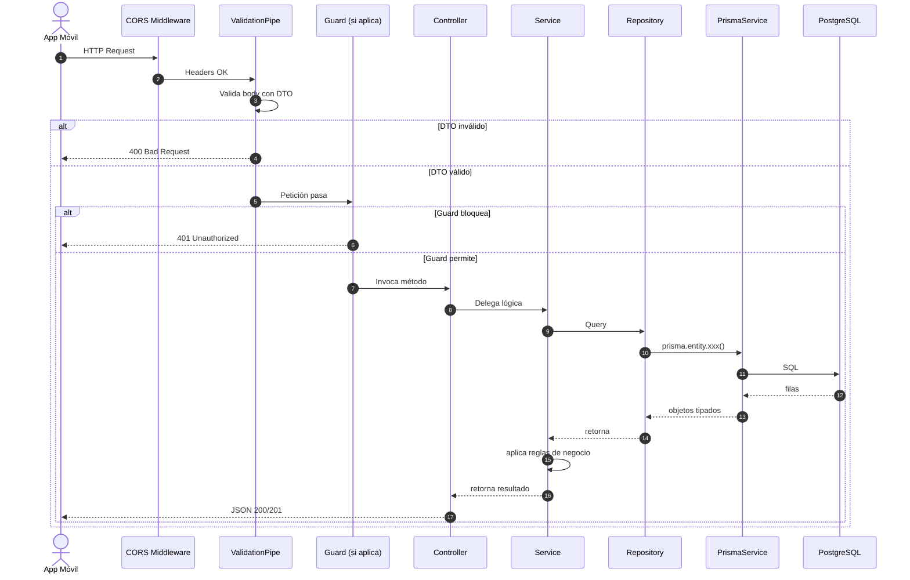

# Arquitectura del Backend

Diagrama que muestra la organización interna del backend NestJS: capas, módulos y flujo de datos.

## Diagrama de capas (Mermaid)



## Estructura de directorios

```
fly-api/ice-cream/
├── prisma/
│   ├── schema.prisma              ← Modelo declarativo
│   ├── seed.ts                    ← Datos iniciales
│   └── migrations/                ← Historial SQL
├── src/
│   ├── main.ts                    ← Bootstrap (dotenv, CORS, Pipes)
│   ├── app.module.ts              ← Registra todos los módulos
│   │
│   ├── prisma/
│   │   └── prisma.service.ts      ← Singleton extendido
│   │
│   ├── auth/
│   │   ├── auth.module.ts
│   │   ├── auth.controller.ts
│   │   └── auth.service.ts        ← sin repository (es simple)
│   │
│   ├── productos/
│   │   ├── productos.module.ts
│   │   ├── productos.controller.ts
│   │   ├── productos.service.ts
│   │   ├── productos.repository.ts
│   │   └── dto/
│   │       ├── create-producto.dto.ts
│   │       └── update-producto.dto.ts
│   │
│   ├── topping/                   ← misma estructura
│   ├── pedidos/                   ← misma estructura
│   │
│   └── admin/
│       ├── admin.module.ts
│       ├── admin.controller.ts    ← protegido con guard
│       ├── admin.service.ts
│       ├── admin.repository.ts
│       └── guards/
│           └── api-key.guard.ts
├── docker-compose.yml
├── .env
├── prisma.config.ts
└── package.json
```

## Módulos y su composición



## Inyección de dependencias (DI)

NestJS usa DI por constructor. Ejemplo completo:

```typescript
// productos.repository.ts
@Injectable()
export class ProductosRepository {
  constructor(private readonly prisma: PrismaService) {}  // ← DI
  // ...
}

// productos.service.ts
@Injectable()
export class ProductosService {
  constructor(private readonly repository: ProductosRepository) {}  // ← DI
  // ...
}

// productos.controller.ts
@Controller("productos")
export class ProductosController {
  constructor(private readonly productosService: ProductosService) {}  // ← DI
  // ...
}

// productos.module.ts
@Module({
  controllers: [ProductosController],
  providers: [ProductosService, ProductosRepository, PrismaService],
  exports: [ProductosService],  // exportado para que PedidosModule lo use
})
export class ProductosModule {}
```

## Ciclo de vida de una petición



## Configuración clave (main.ts)

```typescript
import "dotenv/config";                              // ← carga .env
import { ValidationPipe } from "@nestjs/common";
import { NestFactory } from "@nestjs/core";

async function bootstrap() {
  const app = await NestFactory.create(AppModule);

  app.enableCors();                                  // ← middleware CORS global

  app.useGlobalPipes(new ValidationPipe({            // ← validación global
    whitelist: true,
    forbidNonWhitelisted: true,
    transform: true,
  }));

  const prismaService = app.get(PrismaService);
  await prismaService.enableShutdownHooks(app);      // ← graceful shutdown

  await app.listen(3000, "0.0.0.0");                 // ← bind a todas las IFs
}
bootstrap();
```
