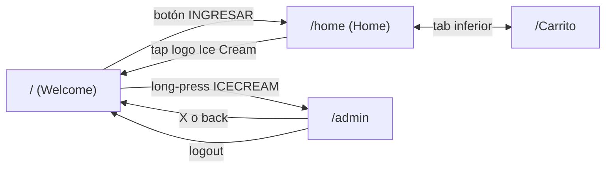
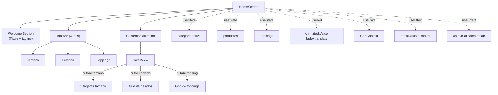
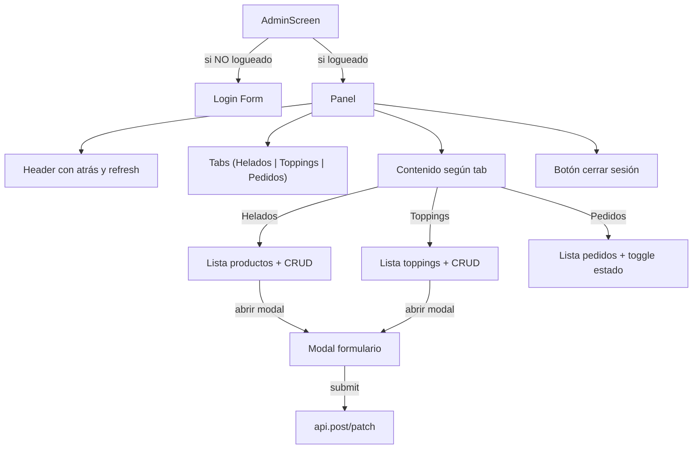

# Arquitectura del Frontend

Organización del proyecto React Native + Expo, con rutas, contexto y servicios.

## Diagrama de capas (Mermaid)

```mermaid
flowchart TB
    User["👤 Usuario<br/>(cliente o admin)"]

    subgraph App["📱 App Móvil Expo"]
        direction TB

        subgraph UI["🎨 Capa de UI (Pantallas)"]
            direction LR
            Welcome["index.tsx<br/>Welcome"]
            Home["(tabs)/home.tsx<br/>Catálogo"]
            Cart["(tabs)/Carrito.tsx<br/>Pedido"]
            Admin["admin.tsx<br/>Panel oculto"]
        end

        subgraph Navigation["🧭 Navegación"]
            Router["Expo Router<br/>(file-based)"]
            RootLayout["app/_layout.tsx"]
            TabsLayout["(tabs)/_layout.tsx"]
        end

        subgraph State["🗂️ Estado compartido"]
            CartCtx["CartContext<br/>- cart[]<br/>- addToCart()<br/>- removeFromCart()<br/>- increase/decreaseQty()<br/>- totalPrice"]
        end

        subgraph Services["📡 Servicios"]
            API["services/api.ts<br/>axios instance<br/>(baseURL, timeout, headers)"]
        end

        subgraph Config["⚙️ Configuración"]
            ConfigTs["constants/Config.ts<br/>API_URL"]
        end
    end

    Backend["🖥️ Backend NestJS<br/>(vía ngrok)"]
    WA["💬 WhatsApp<br/>(deep-link)"]

    User -->|Usa| UI

    RootLayout --> Router
    TabsLayout --> Router
    Router --> UI

    RootLayout -->|envuelve| State

    Home -->|useCart()| CartCtx
    Cart -->|useCart()| CartCtx

    Home -->|GET| API
    Cart -->|POST| API
    Admin -->|CRUD| API

    API --> ConfigTs
    API -->|HTTPS| Backend

    Cart -.->|Linking.openURL| WA

    classDef screen fill:#FCE4EC,stroke:#C2185B
    classDef logic fill:#D6EAF8,stroke:#2874A6
    classDef infra fill:#FDEBD0,stroke:#D68910
    classDef external fill:#E8F8F5,stroke:#16A085

    class Welcome,Home,Cart,Admin screen
    class CartCtx,Router,RootLayout,TabsLayout logic
    class API,ConfigTs infra
    class Backend,WA external
```

## Estructura de directorios

```
fly-app/ice-cream-app/
├── app/                              ← Expo Router (file-based routing)
│   ├── _layout.tsx                   ← Root Stack + CartProvider
│   ├── index.tsx                     ← Welcome screen "/"
│   ├── admin.tsx                     ← Panel admin "/admin" (modal)
│   └── (tabs)/                       ← Grupo de rutas con tab bar
│       ├── _layout.tsx               ← Tab bar inferior
│       ├── home.tsx                  ← "/home"
│       └── Carrito.tsx               ← "/Carrito"
├── context/
│   └── CartContext.tsx               ← Estado global del carrito
├── services/
│   └── api.ts                        ← axios con baseURL
├── constants/
│   ├── Config.ts                     ← API_URL
│   └── api.ts                        ← URL duplicada (histórica)
├── assets/
│   └── images/                       ← imagen-principal.png
├── app.json                          ← configuración Expo
├── package.json
└── tsconfig.json
```

## Rutas registradas por Expo Router

| Ruta URL | Archivo | Descripción |
|---|---|---|
| `/` | `app/index.tsx` | Pantalla de bienvenida |
| `/admin` | `app/admin.tsx` | Panel admin (modal presentation) |
| `/home` | `app/(tabs)/home.tsx` | Catálogo del cliente |
| `/Carrito` | `app/(tabs)/Carrito.tsx` | Carrito + formulario pedido |

## Flujo de navegación



## Capa de UI — detalle de componentes

### Pantalla Home (`home.tsx`)



### Pantalla Admin (`admin.tsx`)



## Componentes reutilizados (no extraídos a archivos)

Como la app es pequeña, los "componentes" son en realidad **fragmentos JSX** dentro de las pantallas. En un proyecto más grande se separarían en `components/`:

- `TabPill` — en `(tabs)/_layout.tsx` (sí extraído)
- `HeladoCard` — inline en `home.tsx` (podría extraerse)
- `ToppingCard` — inline en `home.tsx`
- `CarritoItem` — inline en `Carrito.tsx`
- `PedidoCard` — inline en `admin.tsx`

## Estilos

Cada pantalla tiene su propio `StyleSheet.create({...})` al final del archivo. **No se comparten estilos entre pantallas** — trade-off de simplicidad sobre DRY.

Paletas de color usadas:

| Uso | Hex |
|---|---|
| Rosa primario (Helados, header) | `#FF4D94` |
| Cyan primario (Tamaño, Carrito) | `#00BCD4` |
| Naranja (Toppings) | `#FF9800` |
| Teal (Admin) | `#00838f` |
| Verde WhatsApp | `#25D366` |

## Configuración de axios

```typescript
// services/api.ts
import axios from "axios";

const api = axios.create({
  baseURL: "https://diagram-dreary-recount.ngrok-free.dev",
  timeout: 15000,
  headers: {
    "Content-Type": "application/json",
    Accept: "application/json",
    "ngrok-skip-browser-warning": "true",   // evita página HTML de advertencia de ngrok
  },
});

export default api;
```
