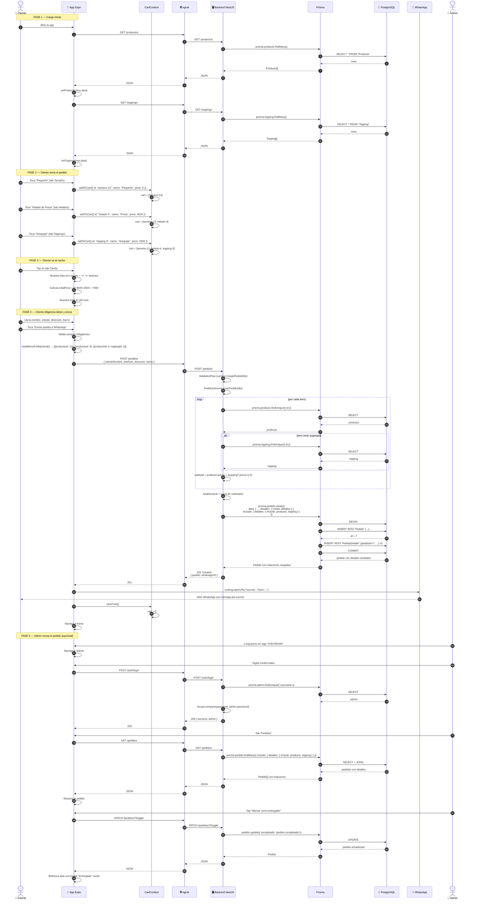

# Diagrama de secuencia — Flujo completo de un pedido

Muestra la secuencia temporal de interacciones entre el cliente, la app, el backend, la base de datos y WhatsApp cuando un usuario realiza un pedido.

## Secuencia (Mermaid)

## Observaciones

### Puntos clave del flujo

- **Paso 27**: el carrito vive en memoria (CartContext). Si el usuario cierra la app antes de enviar, pierde todo.
- **Paso 37**: el backend calcula el total **consultando precios actuales**, no confía en el precio que envía el cliente (seguridad).
- **Paso 49**: la creación usa **nested writes** de Prisma → transacción atómica (si falla un detalle, nada se crea).
- **Paso 54**: WhatsApp se abre **solo si el POST al backend fue exitoso** (evita pedidos fantasma).
- **Paso 57**: `clearCart()` se llama al final para que el usuario no vuelva a enviar por error el mismo carrito.

### Manejo de errores

Si cualquier paso falla:

- **Timeout de axios (15s)** → `AxiosError`, se muestra alerta y no se abre WhatsApp
- **400 Bad Request** (DTO inválido) → backend rechaza, se muestra error
- **500** (error interno) → backend responde error, la app muestra "No se pudo registrar tu pedido"
- **BD caída** → backend devuelve 500, mismo mensaje

## Duración esperada

| Fase | Tiempo |
|---|---|
| Carga inicial (GET productos + toppings) | 300-800ms |
| Interacción del usuario (seleccionar items) | N/A (sin backend) |
| Envío del pedido (POST /pedidos + abrir WhatsApp) | 500-1500ms |
| **Total desde apertura hasta WhatsApp** | ~1-2 minutos con usuario humano |
